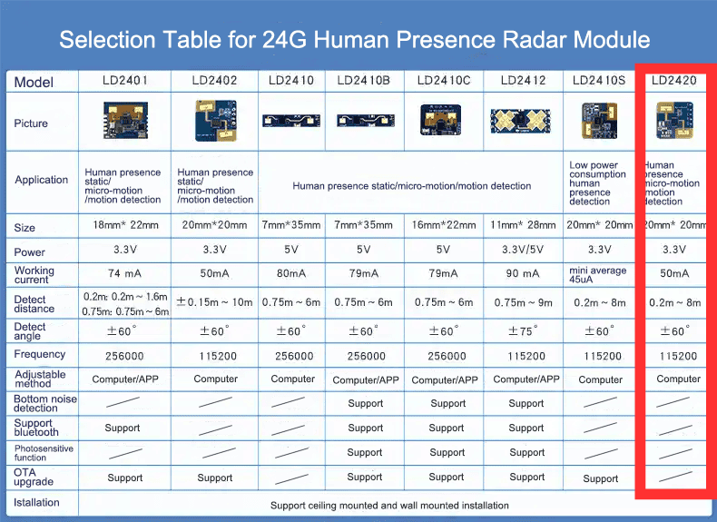

# HLK-LD2420 C Library

This repository provides a library for interfacing with the HLK-LD2420 radar module. The library is designed to be lightweight and easy to integrate into projects using the Raspberry Pi Pico or other platforms, not necessarily based on the RP2040 SoC.

The specific module that this library covers is outlined in the picture (LD2420). It supports 15 range gates, in 0.7 meter increments. The module covers distances from 0.2m ~ 8m, for that reason, the recommended maximum range gate is `10`. This also ensures that the gathered data contains less noise and is more accurate overall.

> Note: The official configuration/calibration tooling for these sensors is for Windows-based systems only. Once the basis of this project is finished, I may start working on a web-based platform for configuring this module with any device.



| Resource Name | Resource URL |
|---|---|
|Sensor Description|<https://www.hlktech.net/index.php?id=1291>|
|Sensor Documentation, Tooling, and Protocol Description|<https://drive.google.com/drive/folders/1IggDH6ejNSOs8EklQbAXcqUI7KENSZLt>|

## Target Support Status

| Target | Status |
| ------ | --------- |
| Native (defaults to host's machine) | Supported |
|Raspberry Pi Pico | In Progress |

> The native target is useful for developing tooling around the HLK-LD2420 sensor which would run locally on your device, such as a command-line tool for interacting with /dev/tty interfaces exposed by this device.

## Features

- Easy-to-use C API for interfacing with the HLK-LD2420 radar module
- Platform-agnostic core library with platform-specific implementations
- Raspberry Pi Pico support with UART communication
- Command packet creation and parsing utilities
- Configuration parameter management (distance, delay, trigger sensitivity, etc.)
- Both native (host machine) and embedded (Pico) compilation targets

## Prerequisites

To use this library, ensure you have the following installed:

- [CMake](https://cmake.org/) (version 3.13 or later)
- Make v3.81
- A supported C/C++ compiler (e.g., GCC). The project is built mostly around GCC, especially for embedded SoCs. For native compilation, any compiler should be fine.

### Compiling for Raspberry Pi Pico

To make sure that you have the full suite of tools installed on your machine, you must make sure that the following packages are installed via your favorite package manager (e.g. apt, brew):

```bash
brew install arm-none-eabi-gcc gcc-arm-embedded arm-none-eabi-binutils
```

### Cloning the Repository

Clone this repository and initialize any required submodules:

```bash
git clone https://github.com/mikayelgr/hlkld2420.git
cd hlkld2420
```

### Building the Library

When building the library, you are going to have two platform choices for now

- Native (default) - Sets the target platform as your machine
- Raspberry Pi Pico - When you want to call this library from your Pico project

#### Building for Native

1. Configure the project using CMake:

   ```bash
   cmake -S. -Bbuild
   ```

2. Build the library:

   ```bash
   make -C build
   ```

3. In the `build/core` directory, you will find a library called `libld2420_core.a/dll/so`. You can link against it.

#### Building for Raspberry Pi Pico

1. Configure the project using CMake:

   ```bash
   cmake -S. -Bbuild -DCMAKE_TOOLCHAIN_FILE=$PICO_SDK_PATH/cmake/preload/toolchains/pico_arm_cortex_m0plus_gcc.cmake -DPICO_SDK_PATH=$PICO_SDK_PATH
   ```

2. Build the library using make:

   ```bash
   make -C build
   ```

3. In the `build/platform/pico` directory, you will find the `libld2420_pico.a/dll/so` library to link against.

> Note: Whenever recompiling for a different platform, you must always clean the build directory and re-run the instructions as provided in this documentation. Not running the exact same way may result in non-reproducible builds.

## API Documentation

The API is fully documented in the source code headers:

- Core API: [`include/ld2420/ld2420.h`](include/ld2420/ld2420.h)
- Raspberry Pi Pico implementation: [`platform/pico/include/ld2420/platform/pico/ld2420_pico.h`](platform/pico/include/ld2420/platform/pico/ld2420_pico.h)

## Adding the Library to Another Project

To use the HLK-LD2420 library in your own project, you can fetch it directly from the GitHub repository using CMake's `FetchContent` module.

> **Note:** This section describes integration patterns that are still being refined. Please report any issues or suggestions for improvement.

### CMake Example

Here's how to integrate the library into your `CMakeLists.txt` for a Raspberry Pi Pico project:

```cmake
include(FetchContent)

FetchContent_Declare(hlkld2420
    GIT_REPOSITORY https://github.com/mikayelgr/hlkld2420.git
    GIT_TAG main  # or specify a specific version/tag
)

FetchContent_MakeAvailable(hlkld2420)

# For your Pico project, add this to your executable
add_executable(your_project main.c)
target_link_libraries(your_project PRIVATE ld2420_pico pico_stdlib)
target_include_directories(your_project PRIVATE ${hlkld2420_SOURCE_DIR}/include)
```

#### Basic Usage in C with Raspberry Pi Pico

Once added, you can go ahead and include the LD2420 library as well as stdlib for Raspberry Pi Pico.

```c
#include "ld2420/platform/pico/ld2420_pico.h"
#include "pico/stdlib.h"
```

## License

This project is licensed under the MIT License. See the `LICENSE` file for details.

## Contributing

Contributions are welcome! Please open an issue or submit a pull request for any improvements or bug fixes.

## Contact

For questions or support, please contact [mikayelgr](https://github.com/mikayelgr).
